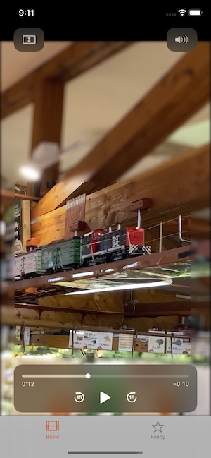

# trim-crop-video
This is in support of a tutorial on using AVComposition

##Basic Tab
The first tab of the app uses an `AVPlayerViewController` for display. When doing this, any edits or changes to the `AVAsset` or `AVItem` need to take place before it gets added to the `AVPlayer`. Once the `AVPlayer` has the item displayed, the Apple controls for playback take over.

After loading an AVAsset, the code modifies the start and end times and applies a crop to make the video into a square.

###Multiple Filters

The `func boxAndBlur(_ item: AVItem)` applies a crop but doesn't shrink the output to the crop size. Instead it applies a separate `CIBoxBlur` filter to the background and then uses a `CISourceAtopComposting` to merge the two images. The result is that the image in the crop rectangle is clear while everything else is blurry.

##Fancy Tab
The second tab of the app uses an `AVPlayer` and an `AVPlayerLayer` to put the video into a regular UIView. When we do this, we have to make our own controls. This view adds a drag and pinch gesture recognizer to the view so we can move a cropping rectangle around.

Also, when playing with the filters in the `AVVideocomposition` added a `CISepiaTone` for the last five seconds, to experiment with the `compositionTime` property of the `request` object.
